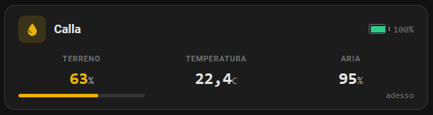
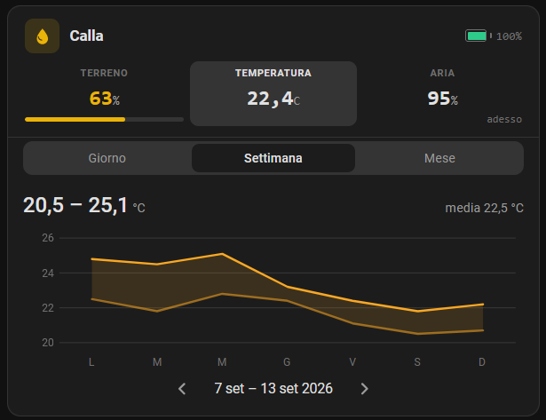

# Tuya Irrigation + Cards for HA

[](https://github.com/hacs/integration)

Home Assistant custom **integration** + two **Lovelace cards** for specific Tuya Zigbee devices (ZHA / Zigbee2MQTT). The integration adds reliable server-side irrigation services; each supported device gets a compact dedicated card. Everything ZHA-specific (the device quirks, including the GiEX clock sync before every open, and the keep-alive) lives in the companion [zha-tuya-quirks](https://github.com/SimoneAvogadro/zha-tuya-quirks) integration — install both for a ZHA valve.

## Supported devices

This project targets two devices in particular — and ships a dedicated Lovelace card for each:

| Device | Exact models | What you get |
|---|---|---|
| **GiEX QT06 smart irrigation valve** | TS0601 — `_TZE200_a7sghmms`, `_TZE204_a7sghmms`, `_TZE200_7ytb3h8u`, `_TZE204_7ytb3h8u`, `_TZE284_7ytb3h8u` | `irrigation_by_seconds` / `irrigation_by_liters` services + `irrigation-control-card` (+ a quirk that fixes clock-sync and start/end-time stamps, from [zha-tuya-quirks](https://github.com/SimoneAvogadro/zha-tuya-quirks)) |
| **HOBEIAN ZG-303Z 3-in-1 soil sensor** (Excellux) | `HOBEIAN ZG-303Z` | `soil-moisture-card` (soil moisture + temperature + air humidity) (+ a DP-mapping quirk, from [zha-tuya-quirks](https://github.com/SimoneAvogadro/zha-tuya-quirks)) |
| **Tuya 2-in-1 soil probe** (no air channel) | TS0601 — `_TZE2841000000_tgrzpqf4` | `soil-moisture-card` (soil moisture + temperature, two-column layout) |

Cards auto-discover their entities from a single primary entity, and a card for a device you don't have simply stays invisible. All ZHA quirks — including the two for these devices — live in the companion repo, see [ZHA layer](#zha-layer-zha-tuya-quirks).


## What's included

| Component | Purpose | Status |
|---|---|---|
| `tuya_irrigation` integration | Server-side `irrigation_by_seconds` / `irrigation_by_liters` services (HA service **target**: listed in the automation editor's "by target" tab for every valve device) + irrigation-history & water-total sensors + keep-alive for weak-signal battery valves (radio side in zha-tuya-quirks) | v2.14.0 |
| `irrigation-control-card` | Lovelace card driving the services above, with battery + Zigbee signal icon | v2.10.0 |
| `soil-moisture-card` | Card for soil moisture + temperature (+ optional air humidity) sensors, with a tap-to-open trend panel (day / week / month) and a Zigbee signal icon | v1.7.0 |

## Installation (HACS)

1. HACS → three-dot menu → **Custom repositories** → add this repo URL, category **Integration**.
2. **Immediately** search "Tuya Irrigation" in HACS → open it → **Download**. *(Do not restart before downloading — see note below.)*
3. **Restart Home Assistant.**
4. Settings → Devices & Services → **Add Integration** → "Tuya Irrigation" → Submit (no inputs).
5. **ZHA valve?** Also install [zha-tuya-quirks](https://github.com/SimoneAvogadro/zha-tuya-quirks) the same way (custom repository, category **Integration**, then add "Tuya ZHA" under Devices & Services). It provides the GiEX QT06 quirk (which also syncs the valve clock before every open) and the keep-alive for weak-signal battery valves. If it's missing, a **repair issue** reminds you; irrigation still works, but start/end stamps drift.
6. The card bundle is served and auto-registered as a Lovelace resource automatically (in *storage* mode, the default); the resource URL carries a content hash, so updated cards show up after a normal page reload. If your dashboard is in YAML mode, add the resource manually under Settings → Dashboards → Resources: url `/tuya_irrigation/tuya-cards.js`, type **module**.

> ⚠️ **Do not restart between steps 1 and 2.** HACS 2.x removes custom repositories that are registered but not yet downloaded at every startup. Click **Download** first — from then on the repo persists across restarts.

**Manual install (no HACS):** copy `custom_components/tuya_irrigation/` into `/config/custom_components/`, restart HA, then do steps 4–6 above.

---

## Services

### `tuya_irrigation.irrigation_by_seconds`

Opens the valve, waits N seconds **server-side**, closes it — independent of the valve firmware's (buggy) native auto-off, so it works with the browser closed and from automations.

| Field | Type | Required | Description |
|---|---|---|---|
| `target` | device / entity / area / label | one of the two | The valve, as a standard HA target — what the UI offers (device picker and "Irrigating" entity picker, both listing only the detected valves). Must contain exactly **one** valve; use one action per valve |
| `switch_entity` | entity_id (switch) | one of the two | The valve switch, for YAML / the card / existing automations (the target wins if both are given) |
| `seconds` | int [1, 43200] | yes | How long to keep the valve open |

```yaml
- action: tuya_irrigation.irrigation_by_seconds
  target:
    device_id: 1f2e3d4c5b6a…          # as picked in the UI
  data:
    seconds: 600   # 10 minutes
# or, by switch entity:
#   data:
#     switch_entity: switch.tze200_a7sghmms_ts0601
#     seconds: 600
# Automations saved before 2.14 with `data: {device_id: …}` keep working unchanged.
```

### `tuya_irrigation.irrigation_by_liters`

Opens the valve, watches `sensor.<prefix>_summation_delivered`, closes when the target volume is delivered. Two safety nets bound a run that never reaches its target: a **stall watchdog** (no measured water for ~5 min → close) and an **adaptive cap** that tightens the maximum runtime toward the flow rate sampled in the first ~2 min — closing sooner when the run should already be done, never past the safety timeout.

| Field | Type | Required | Description |
|---|---|---|---|
| `target` | device / entity / area / label | one of the two | The valve, as a standard HA target — what the UI offers (device picker and "Irrigating" entity picker, both listing only the detected valves). Must contain exactly **one** valve; use one action per valve |
| `switch_entity` | entity_id (switch) | one of the two | The valve switch, for YAML / the card / existing automations (the target wins if both are given) |
| `liters` | number [0.001, 10000] | yes | Target volume to deliver |
| `timeout_seconds` | int [60, 86400] | no (default 3600) | Safety timeout — max time the valve may stay open; the adaptive cap only tightens it downward, never extends it |

```yaml
- action: tuya_irrigation.irrigation_by_liters
  target:
    device_id: 1f2e3d4c5b6a…          # as picked in the UI
  data:
    liters: 10
    timeout_seconds: 1800
```

### Behavior notes

- Calling a service on a switch that's already irrigating **cancels** the previous run and starts the new one.
- On cancel, stop button, or `switch.turn_off`, the run's `finally` still closes the valve — it is never left open.
- At the start of each run the integration writes the device's **mode** (`Duration`/`Capacity`) and **target** (seconds/liters), best-effort and display-only. The valve echoes them back and computes `irrigation_end_time = start + target`, which the card reads for its device-truth progress bar (also for automation-started runs). These writes never block irrigation; the server-side task still owns closing the valve.
- **Restarts/shutdowns close every open valve** — see [Shutdown safety](#shutdown-safety) below.

### Shutdown safety

On any **graceful** HA shutdown (restart, `ha core stop`, host reboot, UPS-triggered poweroff), the integration closes every valve it opened during the session before the process exits:

1. **Pass 1** — cancel all running timer tasks, so each task's own `finally: turn_off` runs.
2. **Pass 2** — explicitly `switch.turn_off` any managed switch HA still reports as `on` (covers a pass-1 that got cut short or a turn-off that silently failed).

You'll see one `Shutdown safety: closing open irrigation valve <entity>` WARNING per valve in the log. No configuration needed.

> A mid-irrigation restart does **not** resume: the run is lost and water stops. This is the safe default — leaving a valve open across a restart with nothing watching the timer would be far worse. Plan long runs around maintenance windows, or trigger them from automations you can simply re-run. This does **not** cover a hard power loss (kernel panic, pulled plug with no UPS) where HA can't run any cleanup; a UPS + OS graceful shutdown is what saves you there.

### Keep-alive (weak-signal battery valves)

Battery valves like the GiEX QT06 are sleepy Zigbee end devices. In a spot with a weak link their spontaneous reports stop reaching the coordinator, and ZHA marks them **unavailable** after `consider_unavailable_battery` (6 h default) even though the valve still works — while the Tuya gateway keeps showing them online.

To prevent this, the integration periodically (once at startup, then every hour) asks [zha-tuya-quirks](https://github.com/SimoneAvogadro/zha-tuya-quirks) (`zha_tuya_quirks.keepalive_poll`) to poke each **idle battery-powered** valve (any detected valve that exposes a battery sensor) with a genuine over-the-air read of its Basic cluster — the reply refreshes ZHA's *last seen* so the device stays online. Without that integration the sweep is skipped and a repair issue is raised. (An entity-level `update_entity` poll would not work here: the Tuya quirk answers the switch's On/Off cluster from local cache without touching the radio.) Mains-powered valves are left alone — ZHA polls those itself. Valves with a run in progress are skipped (they're already communicating). It's best-effort and fully guarded; no configuration needed. If the link is so weak that nothing gets through for 6 h, the keep-alive can't help either — add a mains-powered Zigbee router near the valve, or raise the device's *consider unavailable* timeout in ZHA.

---

## Irrigation history

Every completed run — whether started from the card, an automation, a bare `switch.turn_on`, the physical button, or the firmware's own auto-off — is recorded **server-side** and kept across restarts (and even when the device stops reporting its DPs). The log is the integration's system of record: a `.storage/` JSON file, **outside the recorder DB**, so it never bloats it or gets purged.

Each detected valve gains two entities:

| Entity | What it is |
|---|---|
| `sensor.<prefix>_irrigation_history` | Timestamp of the last completed run. Its `runs` attribute is the recent-run list (newest first: `start`, `end`, `duration_s`, `liters`, `mode`, `target`, `source`, `reason`) that the card's history view reads. The list attribute is excluded from the recorder. |
| `sensor.<prefix>_irrigation_water_total` | Cumulative liters delivered — `total_increasing` / `device_class: water`, so it drops straight into Home Assistant's **water dashboard** and long-term statistics. (The device's own `summation_delivered` resets per session, so the integration keeps this running total itself.) |

Duration is measured server-side from the valve's open→close (no dependence on the device RTC); liters come from the precise server-measured volume for integration runs, or a reset-safe `summation_delivered` delta for manual ones.

On each finished run the integration also fires an **`irrigation_completed`** event on the HA bus, so automations can react (e.g. notify when watering ends):

```yaml
trigger:
  - platform: event
    event_type: irrigation_completed
# event.data: switch_entity, device_id, start, end, duration_s, liters,
#             mode, target, source, reason
```

The event name is deliberately un-namespaced so other irrigation integrations can emit the same event with the same schema; `switch_entity` / `device_id` disambiguate the source.

---

## Automation editor: "by target"

When you add an action by **selecting the valve device first** (the "By target" tab of the add-action dialog), the two services are listed for it next to the plain switch on/off ones, under a "Tuya Irrigation" group:

| Action | Field | Calls |
| --- | --- | --- |
| **Litri🪣💧 (🌱irrigazione a volume)** / *Liters🪣💧 (🌱volume irrigation)* | Liters | `irrigation_by_liters` (adaptive safety cap, 3600 s max) |
| **Secondi⏰💧 (🌱irrigazione a tempo)** / *Seconds⏰💧 (🌱timed irrigation)* | Seconds | `irrigation_by_seconds` |

This works because the services declare a `target:` filtered to this integration's entities, which is what that tab matches against the device's entities. (HA *device actions* would not show up: since HA 2026.8 a device belongs to its owning integration only — ZHA here — and HA asks nobody else for device actions.)

**Valve auto-detection:** a device qualifies when it has both a `switch.*` entity and a `sensor.*` entity with `device_class` `volume` or `water` (energy-metering sockets are ignored), **and** no integration with a dedicated driver for it already owns entities on the device (`FOREIGN_VALVE_PLATFORMS`). The SONOFF SWV-ZF2 is the case that rule exists for: it matches the heuristic, but it is a *dual-line* valve, and this integration is built on one switch per valve — it would have driven line A whatever you picked. Its own integration, [zha-sonoff-quirks](https://github.com/SimoneAvogadro/zha-sonoff-quirks), handles both lines with per-line history, litres and mode. Each detected valve also gets an **"Irrigazione in corso" / "Irrigating"** `binary_sensor`, `on` while a server-side run is active — this association is what makes the services show up for the device in the "by target" tab and gives live feedback.

---

## ZHA layer (zha-tuya-quirks)

This integration holds **no ZHA / zigpy code**: it reasons only about Home Assistant entities (the valve switch, the water-volume sensor, the `select` / `number` the device exposes), so in principle it can drive a valve behind any Zigbee integration. Everything that must talk to the radio lives in the companion [zha-tuya-quirks](https://github.com/SimoneAvogadro/zha-tuya-quirks) integration — either inside the quirk (no coordination needed) or, for the keep-alive, behind a service this integration calls best-effort and only if registered:

| Need | Provided by |
|---|---|
| GiEX QT06 quirk (2000 epoch for `commandMcuSyncTime`, local-timezone start/end stamps) | quirk `giex_qt06_epoch2000.py` in zha-tuya-quirks |
| HOBEIAN ZG-303Z soil sensor quirk (humidity channel swap, DP routing) | quirk `hobeian_zg303z.py` in zha-tuya-quirks |
| Device clock sync right before each valve open (Tuya 0x24 + ~1.5 s settle), so the device stamps correct `irrigation_start_time` / `irrigation_end_time` — for every origin, automations included | the GiEX quirk itself, inserted in front of the on/off DP; nothing to call |
| Keep-alive over-the-air read for idle battery valves | service `zha_tuya_quirks.keepalive_poll`, called from the hourly sweep |

The two quirks used to ship inside this integration (up to v2.13.0) and moved over unchanged — same clusters, same entity ids, nothing to rename. **Update order on an existing install: zha-tuya-quirks first, then this repo.** During the overlap both register the same quirk, which is harmless; the reverse order leaves the devices on the upstream quirk for one restart. If you previously deployed any of these manually under `/config/custom_zha_quirks/`, **delete the manual copy** (ZHA keeps the last-loaded quirk for a `(manufacturer, model)`, so the manual file would shadow the bundled one).

When a ZHA valve is detected and the companion integration is not loaded, a **repair issue** ("Tuya ZHA integration missing") is raised and clears itself once it is.

---

## Irrigation Control Card

Compact card for the GiEX valve — replaces a handful of scattered entities with one widget that drives the integration's services.

- **Dual-mode manual irrigation**: by liters or by seconds, dispatched server-side.
- **Device-truth progress bar**: derived from the device's own telemetry, not a client timer. Tempo uses `irrigation_end_time − irrigation_start_time`; Liters uses `summation_delivered / target`. Survives a browser refresh, stays in sync across tabs, never drifts, and shows progress even for automation-started runs.
- **History**: the idle row shows the last run (start time, duration, liters) and a chevron that expands a scrollable list of past runs — start time, duration, liters and an outcome dot — read from `sensor.<prefix>_irrigation_history`. Same layout as the Sonoff valve card in [zha-sonoff-quirks](https://github.com/simoneavogadro/zha-sonoff-quirks). See [Irrigation history](#irrigation-history).
- **Auto-discovery** from a single switch entity; **visual editor** lists only switches with all companion entities.
- **Battery indicator** with a **Zigbee signal icon** to its left (WiFi-style arcs, see [Signal quality icon](#signal-quality-icon)), **integration-missing banner**, **theme-aware** (HA CSS variables).

The cycles/interval scheduling UI is hidden for now; the code is preserved and will return once the integration gains a scheduling service.

```yaml
type: custom:irrigation-control-card
switch: switch.tze200_a7sghmms_ts0601
name: Irrigatore 31  # optional, defaults to friendly_name
```

**Entity suffix mapping** (given `switch.<PREFIX>`):

| Key | Domain | Suffix | Required |
|-----|--------|--------|----------|
| mode | select | `_irrigation_mode` | Yes |
| target | number | `_irrigation_target` | Yes |
| cycles | number | `_irrigation_cycles` | Yes (UI hidden) |
| interval | number | `_irrigation_interval` | Yes (UI hidden) |
| last_duration | sensor | `_last_irrigation_duration` | Yes |
| summation | sensor | `_summation_delivered` | Yes |
| battery | sensor | `_battery` | No |
| start_time | sensor | `_irrigation_start_time` | No |
| end_time | sensor | `_irrigation_end_time` | No |
| history | sensor | `_irrigation_history` | No |
| lqi / linkquality / rssi | sensor | `_lqi`, `_linkquality`, `_rssi` | No (signal icon) |

---

## Soil Moisture Card

Compact card for Tuya soil probes — soil moisture, temperature and air humidity in a three-column layout (two columns on 2-in-1 probes without an air channel), with a colored progress bar for soil moisture.

<p>
  
  
</p>

- **Configurable thresholds**: optimal (green) and acceptable (yellow) ranges per plant; outside acceptable = red.
- **Auto-discovery** from a single `_soil_moisture` sensor; **visual editor** with threshold config; **battery indicator** with a **Zigbee signal icon** to its left (see [Signal quality icon](#signal-quality-icon)).
- **Trend panel**: tap a reading (soil, temperature or air) to open a section under the readings — same look as the energy-statistics panel of the [Tuya ZHA power-switch card](https://github.com/SimoneAvogadro/zha-tuya-quirks). **Day** shows the recorded trend of the value; **Week** and **Month** show two lines, the daily min and max, with a band between them. The header gives the period's min – max and mean; tap a point (or a day) to read it, `◀` / `▶` step through periods. Tap the open column to close it, another column to switch metric. Data comes straight from the recorder — raw history for the day view (falls back to hourly statistics beyond the recorder's retention), long-term daily statistics for week / month — so nothing needs to be configured.

```yaml
type: custom:soil-moisture-card
entity: sensor.umidita_terreno_1_soil_moisture
name: Umidita terreno 1
opt_min: 40
opt_max: 60
acc_min: 20
acc_max: 80
```

**Threshold color logic:**

```
  RED    |  YELLOW  |  GREEN  |  YELLOW  |  RED
---------+----------+---------+----------+---------
  0%   acc_min   opt_min   opt_max   acc_max   100%
```

**Entity suffix mapping:**

| Key | Domain | Suffix | Required |
|-----|--------|--------|----------|
| soil_moisture | sensor | `_soil_moisture` | Yes |
| temperature | sensor | `_temperature` | Yes |
| humidity | sensor | `_humidity` | Yes |
| battery | sensor | `_battery` | No |
| lqi / linkquality / rssi | sensor | `_lqi`, `_linkquality`, `_rssi` | No (signal icon) |

---

## Signal quality icon

Both cards show a small WiFi-style icon (three arcs + dot) to the left of the battery when the device exposes a signal-quality entity. Nothing to configure — the icon appears as soon as the entity exists and disappears (with the battery) when the device is offline.

- **ZHA**: `sensor.<prefix>_lqi` and `sensor.<prefix>_rssi` are *diagnostic* entities, **disabled by default**. Enable at least one from the device page (Settings → Devices & Services → the device → "+N entities not shown" → enable). LQI is preferred; RSSI is used only when it is the sole one enabled.
- **Zigbee2MQTT**: `sensor.<prefix>_linkquality` is created automatically.

| Arcs lit | LQI (0–255) | RSSI (fallback) |
|---|---|---|
| 4 | ≥ 200 | ≥ −60 dBm |
| 3 | ≥ 150 | ≥ −70 dBm |
| 2 | ≥ 100 | ≥ −80 dBm |
| 1 (red) | < 100 | < −80 dBm |

Hovering the icon shows the raw values (`LQI 120 · RSSI -70 dBm`). Zigbee values are per-hop, so a valve behind a router reports the quality of the link to that router, not to the coordinator.

---

## Technical details

- **Integration**: pure-Python `custom_components/tuya_irrigation/`, no external dependencies. Uses `async_register_static_paths` + `StaticPathConfig` (HA ≥ 2024.1).
- **Cards**: pure `HTMLElement` with Shadow DOM (no LitElement). Bundle concatenated by `bash build.sh`. `src/sensor-trend-panel.js` is **not a card**: it is the `<sensor-trend-panel>` element the soil-moisture card opens under its readings, reusable by other cards.
- **Theming**: HA CSS variables. **Localization**: IT / EN / ZH via `localStorage.selectedLanguage`.

```bash
# Rebuild the card bundle (concatenates src/*.js → tuya-cards.js, copies into the integration's www/)
bash build.sh
# Integration changes are HA-side: restart HA or reload the integration.
```

Plan doc for the v2.0 architecture: [`docs/PLAN-integration-v2.md`](docs/PLAN-integration-v2.md).

## License

[MIT](LICENSE)
