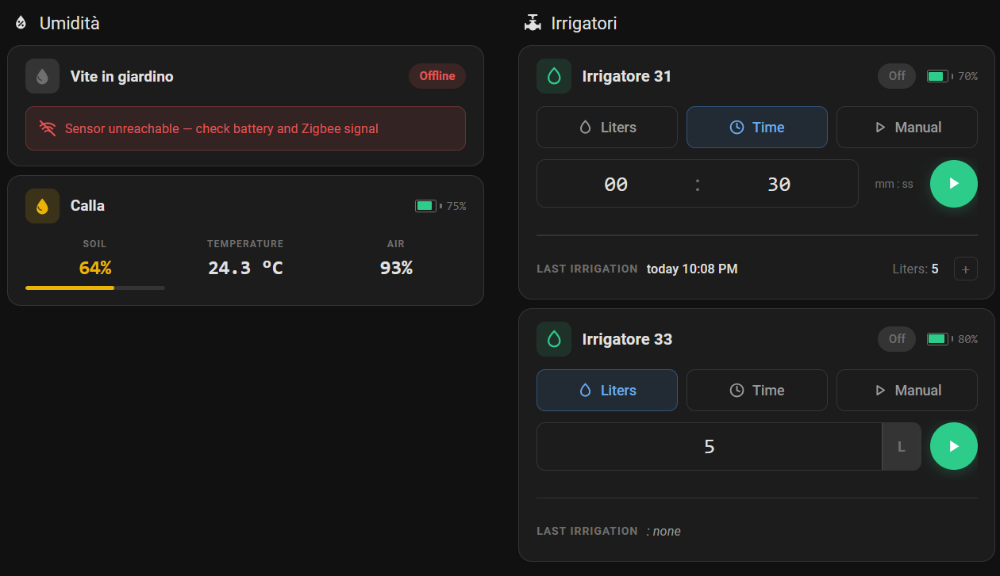

# Tuya Irrigation + Cards for HA

[](https://github.com/hacs/integration)

Home Assistant custom **integration** + two **Lovelace cards** for specific Tuya Zigbee devices (ZHA / Zigbee2MQTT). The integration adds reliable server-side irrigation services and bundled ZHA quirks; each supported device gets a compact dedicated card.

## Supported devices

This project targets two devices in particular — and ships a dedicated Lovelace card for each:

| Device | Exact models | What you get |
|---|---|---|
| **GiEX QT06 smart irrigation valve** | TS0601 — `_TZE200_a7sghmms`, `_TZE204_a7sghmms`, `_TZE200_7ytb3h8u`, `_TZE204_7ytb3h8u`, `_TZE284_7ytb3h8u` | `irrigation_by_seconds` / `irrigation_by_liters` services + `irrigation-control-card` + a quirk that fixes clock-sync and start/end-time stamps |
| **HOBEIAN ZG-303Z 3-in-1 soil sensor** (Excellux) | `HOBEIAN ZG-303Z` | `soil-moisture-card` (soil moisture + temperature + air humidity) + a DP-mapping quirk |

Cards auto-discover their entities from a single primary entity, and a card for a device you don't have simply stays invisible. Other Tuya quirks (e.g. the `TS0001` switch) now live in a dedicated repo — see [Bundled ZHA quirks](#bundled-zha-quirks).



## What's included

| Component | Purpose | Status |
|---|---|---|
| `tuya_irrigation` integration | Server-side `irrigation_by_seconds` / `irrigation_by_liters` services + device actions + irrigation-history & water-total sensors + bundled ZHA quirks | v2.5.3 |
| `irrigation-control-card` | Lovelace card driving the services above | v2.5.3 |
| `soil-moisture-card` | Card for soil moisture + temperature + air humidity sensors | v1.1.2 |

## Installation (HACS)

1. HACS → three-dot menu → **Custom repositories** → add this repo URL, category **Integration**.
2. **Immediately** search "Tuya Irrigation" in HACS → open it → **Download**. *(Do not restart before downloading — see note below.)*
3. **Restart Home Assistant.**
4. Settings → Devices & Services → **Add Integration** → "Tuya Irrigation" → Submit (no inputs).
5. The card bundle is served and auto-registered as a Lovelace resource automatically (in *storage* mode, the default). Hard-refresh the browser (Ctrl+Shift+R). If your dashboard is in YAML mode, add the resource manually under Settings → Dashboards → Resources: url `/tuya_irrigation/tuya-cards.js`, type **module**.

> ⚠️ **Do not restart between steps 1 and 2.** HACS 2.x removes custom repositories that are registered but not yet downloaded at every startup. Click **Download** first — from then on the repo persists across restarts.

**Manual install (no HACS):** copy `custom_components/tuya_irrigation/` into `/config/custom_components/`, restart HA, then do steps 4–5 above.

---

## Services

### `tuya_irrigation.irrigation_by_seconds`

Opens the valve, waits N seconds **server-side**, closes it — independent of the valve firmware's (buggy) native auto-off, so it works with the browser closed and from automations.

| Field | Type | Required | Description |
|---|---|---|---|
| `switch_entity` | entity_id (switch) | yes | Valve switch to control |
| `seconds` | int [1, 43200] | yes | How long to keep the valve open |

```yaml
- service: tuya_irrigation.irrigation_by_seconds
  data:
    switch_entity: switch.tze200_a7sghmms_ts0601
    seconds: 600   # 10 minutes
```

### `tuya_irrigation.irrigation_by_liters`

Opens the valve, watches `sensor.<prefix>_summation_delivered`, closes when the target volume is delivered (or the safety timeout fires).

| Field | Type | Required | Description |
|---|---|---|---|
| `switch_entity` | entity_id (switch) | yes | Valve switch to control |
| `liters` | number [0.001, 10000] | yes | Target volume to deliver |
| `timeout_seconds` | int [60, 86400] | no (default 3600) | Force-close if volume never reached |

```yaml
- service: tuya_irrigation.irrigation_by_liters
  data:
    switch_entity: switch.tze200_a7sghmms_ts0601
    liters: 10
    timeout_seconds: 1800
```

### Behavior notes

- Calling a service on a switch that's already irrigating **cancels** the previous run and starts the new one.
- On cancel, stop button, or `switch.turn_off`, the run's `finally` still closes the valve — it is never left open.
- At the start of each run the integration writes the device's **mode** (`Duration`/`Capacity`) and **target** (seconds/liters), best-effort and display-only. The valve echoes them back and computes `irrigation_end_time = start + target`, which the card reads for its device-truth progress bar (also for automation-started runs). These writes never block irrigation; the server-side task still owns closing the valve.
- **Restarts/shutdowns close every open valve** — see [Shutdown safety](#shutdown-safety) below.

### Shutdown safety

On any **graceful** HA shutdown (restart, `ha core stop`, host reboot, UPS-triggered poweroff), the integration closes every valve it opened during the session before the process exits:

1. **Pass 1** — cancel all running timer tasks, so each task's own `finally: turn_off` runs.
2. **Pass 2** — explicitly `switch.turn_off` any managed switch HA still reports as `on` (covers a pass-1 that got cut short or a turn-off that silently failed).

You'll see one `Shutdown safety: closing open irrigation valve <entity>` WARNING per valve in the log. No configuration needed.

> A mid-irrigation restart does **not** resume: the run is lost and water stops. This is the safe default — leaving a valve open across a restart with nothing watching the timer would be far worse. Plan long runs around maintenance windows, or trigger them from automations you can simply re-run. This does **not** cover a hard power loss (kernel panic, pulled plug with no UPS) where HA can't run any cleanup; a UPS + OS graceful shutdown is what saves you there.

---

## Irrigation history

Every completed run — whether started from the card, an automation, a bare `switch.turn_on`, the physical button, or the firmware's own auto-off — is recorded **server-side** and kept across restarts (and even when the device stops reporting its DPs). The log is the integration's system of record: a `.storage/` JSON file, **outside the recorder DB**, so it never bloats it or gets purged.

Each detected valve gains two entities:

| Entity | What it is |
|---|---|
| `sensor.<prefix>_irrigation_history` | Timestamp of the last completed run. Its `runs` attribute is the recent-run list (newest first: `start`, `end`, `duration_s`, `liters`, `mode`, `target`, `source`, `reason`) that the card's history view reads. The list attribute is excluded from the recorder. |
| `sensor.<prefix>_irrigation_water_total` | Cumulative liters delivered — `total_increasing` / `device_class: water`, so it drops straight into Home Assistant's **water dashboard** and long-term statistics. (The device's own `summation_delivered` resets per session, so the integration keeps this running total itself.) |

Duration is measured server-side from the valve's open→close (no dependence on the device RTC); liters come from the precise server-measured volume for integration runs, or a reset-safe `summation_delivered` delta for manual ones.

On each finished run the integration also fires an **`irrigation_completed`** event on the HA bus, so automations can react (e.g. notify when watering ends):

```yaml
trigger:
  - platform: event
    event_type: irrigation_completed
# event.data: switch_entity, device_id, start, end, duration_s, liters,
#             mode, target, source, reason
```

The event name is deliberately un-namespaced so other irrigation integrations can emit the same event with the same schema; `switch_entity` / `device_id` disambiguate the source.

---

## Device actions (automation builder)

When you build an automation by **selecting a device first**, any recognized irrigation valve gains two extra actions:

| Action | Field | Calls |
| --- | --- | --- |
| **Irriga per litri** / *Irrigate by liters* | Liters | `irrigation_by_liters` (timeout fixed at 3600 s) |
| **Irriga per tempo** / *Irrigate for a duration* | Duration (hh:mm:ss) | `irrigation_by_seconds` |

**Valve auto-detection:** a device qualifies when it has both a `switch.*` entity and a `sensor.*` entity with `device_class` `volume` or `water` (energy-metering sockets are ignored). Each detected valve also gets an **"Irrigazione in corso" / "Irrigating"** `binary_sensor`, `on` while a server-side run is active — this association is what surfaces the device actions and gives live feedback.

---

## Bundled ZHA quirks

The integration ships custom ZHA quirks under `custom_components/tuya_irrigation/quirks/`, imported as a side-effect on load — they register with zigpy's global registry exactly as if dropped into `zha.custom_quirks_path`. **No `configuration.yaml` change and no manual copy needed** — installing/updating via HACS is enough.

| File | Devices | What it fixes |
|---|---|---|
| `giex_qt06_epoch2000.py` | `_TZE200_a7sghmms` / `_TZE204_a7sghmms` / `_TZE200_7ytb3h8u` / `_TZE204_7ytb3h8u` / `_TZE284_7ytb3h8u` (TS0601 GiEX QT06) | Answers `commandMcuSyncTime` with the 2000-01-01 Tuya epoch (not the upstream 1970), so the firmware stops re-firing `MCU_SYNC` aggressively (which drained the battery in days and made `irrigation_end_time` flap). Also patches `giex_string_to_dt` so start/end times use HA's local timezone (upstream hardcodes +04:00) and tolerate the startup-restored value. The integration additionally syncs the device clock (Tuya 0x24) at each run start. |
| `hobeian_zg303z.py` | `HOBEIAN ZG-303Z` (Excellux 3-in-1 soil sensor) | Maps DP 5 → temperature, DP 109 → soil moisture; routes the other periodic DPs (3, 9, 15, 102, 104, 105, 110, 111, 112) to a no-op so ZHA stops replying `UNSUPPORTED_ATTRIBUTE` (which the sleepy device fails to retrieve in time, cascading into `MAC_INDIRECT_TIMEOUT`). |

> Non-irrigation Tuya quirks (e.g. the `TS0001` switch `external_switch_type` select) now live in a dedicated repo: [zha-tuya-quirks](https://github.com/SimoneAvogadro/zha-tuya-quirks).

If you previously deployed any of these manually under `/config/custom_zha_quirks/`, **delete the manual copy** after upgrading (ZHA keeps the last-loaded quirk for a `(manufacturer, model)`, so the manual file would shadow the bundled one). Paired devices may need a one-off **Reconfigure** (device → ⋮ → Reconfigure) to pick up the new quirk class.

---

## Irrigation Control Card

Compact card for the GiEX valve — replaces a handful of scattered entities with one widget that drives the integration's services.

- **Dual-mode manual irrigation**: by liters or by seconds, dispatched server-side.
- **Device-truth progress bar**: derived from the device's own telemetry, not a client timer. Tempo uses `irrigation_end_time − irrigation_start_time`; Liters uses `summation_delivered / target`. Survives a browser refresh, stays in sync across tabs, never drifts, and shows progress even for automation-started runs.
- **History**: the expanded "last irrigation" view (live while a run is in progress) nests a second **"+"** that opens a scrollable list of past runs (when / duration / liters / outcome), read from `sensor.<prefix>_irrigation_history`. See [Irrigation history](#irrigation-history).
- **Auto-discovery** from a single switch entity; **visual editor** lists only switches with all companion entities.
- **Battery indicator**, **integration-missing banner**, **theme-aware** (HA CSS variables).

The cycles/interval scheduling UI is hidden for now; the code is preserved and will return once the integration gains a scheduling service.

```yaml
type: custom:irrigation-control-card
switch: switch.tze200_a7sghmms_ts0601
name: Irrigatore 31  # optional, defaults to friendly_name
```

**Entity suffix mapping** (given `switch.<PREFIX>`):

| Key | Domain | Suffix | Required |
|-----|--------|--------|----------|
| mode | select | `_irrigation_mode` | Yes |
| target | number | `_irrigation_target` | Yes |
| cycles | number | `_irrigation_cycles` | Yes (UI hidden) |
| interval | number | `_irrigation_interval` | Yes (UI hidden) |
| last_duration | sensor | `_last_irrigation_duration` | Yes |
| summation | sensor | `_summation_delivered` | Yes |
| battery | sensor | `_battery` | No |
| start_time | sensor | `_irrigation_start_time` | No |
| end_time | sensor | `_irrigation_end_time` | No |
| history | sensor | `_irrigation_history` | No |

---

## Soil Moisture Card

Compact card for the HOBEIAN sensor — soil moisture, temperature and air humidity in a three-column layout, with a colored progress bar for soil moisture.

- **Configurable thresholds**: optimal (green) and acceptable (yellow) ranges per plant; outside acceptable = red.
- **Auto-discovery** from a single `_soil_moisture` sensor; **visual editor** with threshold config; **battery indicator**.

```yaml
type: custom:soil-moisture-card
entity: sensor.umidita_terreno_1_soil_moisture
name: Umidita terreno 1
opt_min: 40
opt_max: 60
acc_min: 20
acc_max: 80
```

**Threshold color logic:**

```
  RED    |  YELLOW  |  GREEN  |  YELLOW  |  RED
---------+----------+---------+----------+---------
  0%   acc_min   opt_min   opt_max   acc_max   100%
```

**Entity suffix mapping:**

| Key | Domain | Suffix | Required |
|-----|--------|--------|----------|
| soil_moisture | sensor | `_soil_moisture` | Yes |
| temperature | sensor | `_temperature` | Yes |
| humidity | sensor | `_humidity` | Yes |
| battery | sensor | `_battery` | No |

---

## Technical details

- **Integration**: pure-Python `custom_components/tuya_irrigation/`, no external dependencies. Uses `async_register_static_paths` + `StaticPathConfig` (HA ≥ 2024.1).
- **Cards**: pure `HTMLElement` with Shadow DOM (no LitElement). Bundle concatenated by `bash build.sh`.
- **Theming**: HA CSS variables. **Localization**: IT / EN / ZH via `localStorage.selectedLanguage`.

```bash
# Rebuild the card bundle (concatenates src/*.js → tuya-cards.js, copies into the integration's www/)
bash build.sh
# Integration changes are HA-side: restart HA or reload the integration.
```

Plan doc for the v2.0 architecture: [`docs/PLAN-integration-v2.md`](docs/PLAN-integration-v2.md).

## License

[MIT](LICENSE)
